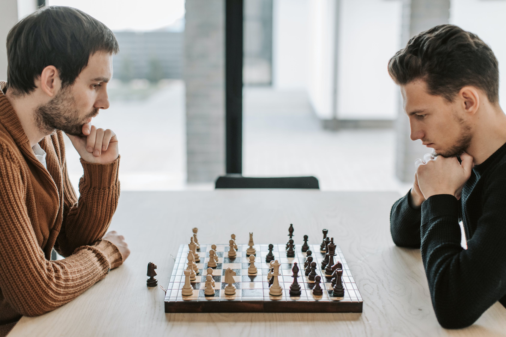

# 3d-chess-replayer

This program allows you to create more and less famous chess plays in 3D! 
Upload a chosen portable game notation and press play.

## How to install and upload a game notation

1) ...
2) ...
3) ...

## Authors & Contributors

rojberr & Digit16

## TODO

1) Create parser for Chess Portable Notation
2) Model for chess board
3) Model for pieces
4) ...